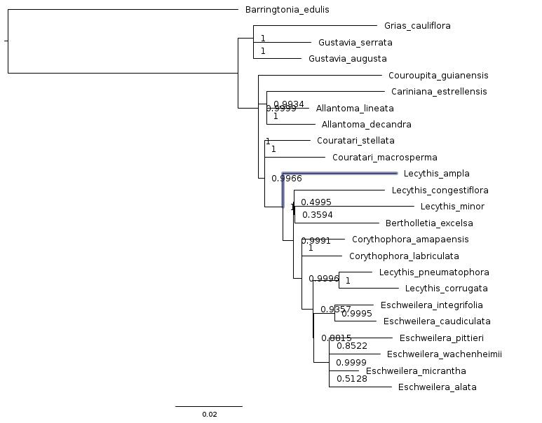

# The Patterns of Evolution: A Phylogenetic Analysis of Fur Pattern Evolution in Panthera

## The main question of my project is what evolutionary mechanisms and genetic changes led to the development and evolution of the distinct fur patterns and color within the Panthera genus. I hypothesize that the variations in fur colors and patterns across the Panthera species can be directly correlated to their divergence and adaptive evolution to new environments. As Panthera dispersed to new environments spanning several continents they faced selective pressures that forced them to adapt their fur in order to camouflage and remain efficient predators. By mapping and identifying specific genomic variations associated with fur color and pattern across the Panthera genus, I will be able to identify specific genetic loci and evolutionary elements that contributed to their adaptive radiation. This project will not only increase our understanding of Panthera evolution but will also enhance our understanding of specific evolutionary principles. Identifying genetic adaptations to differing environmental pressures will show how ecological challenges shape evolution at a molecular level. I will explore how phenotypic divergence is obtained through physical and ecological isolation compounded by selective pressures. I plan on determining how fitness through survival and reproductive success relates to how fur affects camouflage and hunting efficiency. By analyzing the importance of predator-prey relationships from an evolutionary perspective I will be able to determine how they are capable of driving evolutionary changes and altering the structure of an ecosystem. Understanding how Panthera trait variability is affected by environmental challenges could unlock new avenues of conservation. 

### The focal group of my project will be the entirety of Genus Panthera. The extant members of this genus are lion (Panthera leo), tiger (Panthera tigris), jaguar (Panthera onca), leopard (Panthera pardus), and snow leopard (Panthera uncia). Panthera also has several extinct members, some of which have sequences on Genbank like ​​the American lion (Panthera atrox), Eurasian cave lion (Panthera spelaea), and Panthera onca mesembrina. Using the subfamily Pantherinae would slightly expand the total number of species, as this combines Genus Panthera and Genus Neofelis which contains the Clouded leopard (Neofelis nebulosa) and Sunda clouded leopard (Neofelis diardi). They would serve as a good outgroup for my phylogenetic tree. The genus Panthera is believed to have originated in Asia around 10-15 million years ago with phylogenetic studies estimating divergence of the species occurring between 3.9 and 1.9 million years ago (Johnson et al., 2006). Using fossil evidence researchers have been able to estimate the paths Panthera made as they dispersed through various regions of Asia, Africa, Europe, and North America (Antón et al., 2004).

Using 3 to 5 regions from the mitochondrial genome, I will perform a phylogenetic analysis in order to determine the phylogeny of the Panthera genus. Once I find the proper mitochondrial sequences, I will be able to determine which phylogenetic inference would be best suited to my data. I am considering Parsimony, Maximum Likelihood, and Bayesian Inference. I will also use this phylogenetic analysis to determine divergence points, distribution across geographical regions, and patterns or processes of trait evolution. Using this evolutionary history I will be able to gain more insights on Panthera evolution and test my hypothesis of the evolution of fur pattern and color correlated to dispersal. I will also be able to determine what evolutionary mechanisms and genetic changes caused their speciation and unique fur patterns and color. The specific mitochondrial genome regions will be identified using related scientific research papers’ GenBank accession numbers.

References:
Antón, M., García-Perea, R., & Turner, A. (2004). Reconstructed facial appearance of the sabretoothed felid Smilodon. Zoological Journal of the Linnean Society, 140(1), 129-141.

Johnson, W. E., Eizirik, E., Pecon-Slattery, J., Murphy, W. J., Antunes, A., Teeling, E., & O'Brien, S. J. (2006). The late Miocene radiation of modern Felidae: a genetic assessment. Science, 311(5757), 73-77.

Davis, B. W., Li, G., & Murphy, W. J. (2010). Supermatrix and species tree methods resolve phylogenetic relationships within the big cats, Panthera (Carnivora: Felidae). Molecular Phylogenetics and Evolution, 56(1), 64-76.

